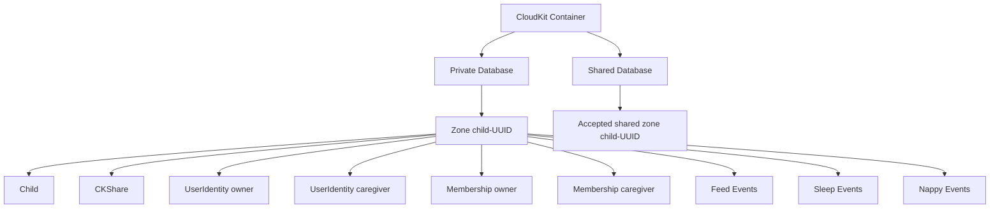
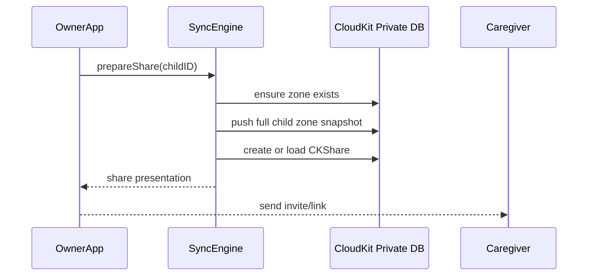
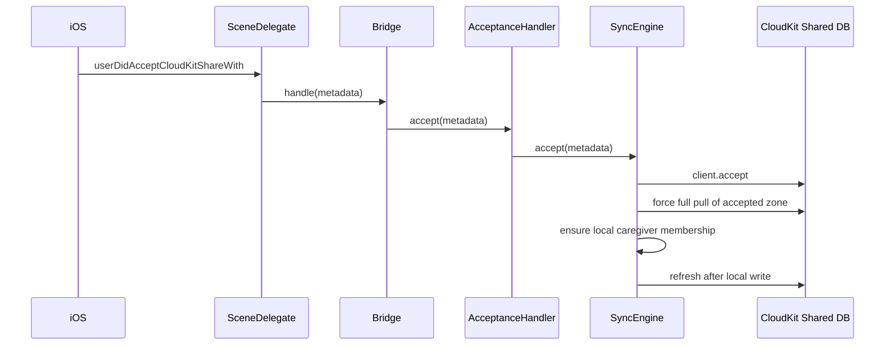
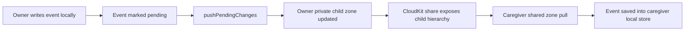
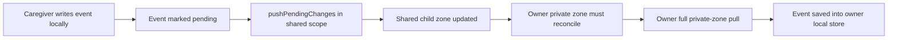

# CloudKit Sync Engine Guide

## Purpose

This document explains how Baby Tracker's custom CloudKit sync engine works, what we learned during the sharing investigation on March 27, 2026, and what was changed to make owner and caregiver sync behave correctly.

This is the current high-level reference for:

- how data is stored in CloudKit
- how data moves between devices
- how sharing works
- what failure modes we found
- what fixes are now in place

Relevant Apple documentation:

- [CloudKit overview](https://developer.apple.com/icloud/cloudkit/)
- [CKDatabase](https://developer.apple.com/documentation/cloudkit/ckdatabase?language=objc)
- [CKRecord](https://developer.apple.com/documentation/cloudkit/ckrecord)
- [Sharing CloudKit Data with Other iCloud Users](https://developer.apple.com/documentation/CloudKit/sharing-cloudkit-data-with-other-icloud-users)
- [CKShare.Participant](https://developer.apple.com/documentation/cloudkit/ckshare/participant)
- [CKFetchRecordZoneChangesOperation](https://developer.apple.com/documentation/CloudKit/CKFetchRecordZoneChangesOperation)
- [Remote Records](https://developer.apple.com/documentation/cloudkit/remote-records)

---

## Why We Have a Custom Sync Engine

Baby Tracker does not use `NSPersistentCloudKitContainer` for app data sync. Instead, it uses a custom sync layer in `BabyTrackerSync` so the app can control:

- one CloudKit zone per child
- explicit owner and caregiver sharing
- record-level conflict handling
- local repair logic for incomplete share state

The main type is [`CloudKitSyncEngine.swift`](/Users/brianmurphy/Documents/Development/iOS/Baby%20Tracker/Packages/BabyTrackerSync/Sources/BabyTrackerSync/CloudKitSyncEngine.swift).

The record mapping logic lives in [`CloudKitRecordMapper.swift`](/Users/brianmurphy/Documents/Development/iOS/Baby%20Tracker/Packages/BabyTrackerSync/Sources/BabyTrackerSync/CloudKitRecordMapper.swift).

---

## Core Model

### Container and Zones

The app uses one CloudKit container:

- `iCloud.com.adappt.BabyTracker`

Each child gets its own custom record zone:

- `child-<child UUID>`

That means CloudKit data is partitioned by child, not by user.

### Database Scopes

- Owner devices read and write the child's zone in the `.private` database.
- Caregiver devices read and write the same shared child through the `.shared` database.

Apple’s [`CKDatabase`](https://developer.apple.com/documentation/cloudkit/ckdatabase?language=objc) documentation is the key reference for this model: each user has separate private and shared databases, and the shared database contains records other users have shared with them.

Locally, each child stores a `CloudKitChildContext`, which tells the engine:

- which zone belongs to the child
- whether the child currently syncs through `.private` or `.shared`
- which share record name belongs to that child

---

## What We Store

Each child zone contains:

- `Child`
- `UserIdentity`
- `Membership`
- `BreastFeedEvent`
- `BottleFeedEvent`
- `SleepEvent`
- `NappyEvent`
- `CKShare` when the child is shared

### Data Shape



### Important CloudKit Sharing Rule

CloudKit sharing does not automatically include every record in a zone just because it lives in the same zone.

The share follows the root record hierarchy.

Apple exposes that relationship on [`CKRecord.parent`](https://developer.apple.com/documentation/cloudkit/ckrecord), which is why the mapper now treats parent references as part of the share model instead of optional metadata.

That is why memberships, user identities, and events now all point back to the child record with `record.parent`.

Without that parent-child hierarchy:

- the recipient can accept the share
- the child record can appear
- but the rest of the data can be missing from the shared graph

That behavior is documented directly in [`CloudKitRecordMapper.swift`](/Users/brianmurphy/Documents/Development/iOS/Baby%20Tracker/Packages/BabyTrackerSync/Sources/BabyTrackerSync/CloudKitRecordMapper.swift).

---

## Sync Engine Lifecycle

The engine exposes three main entry points:

- `prepareForLaunch()`
- `refreshForeground()`
- `refreshAfterLocalWrite()`

All of them feed into `refresh(reason:)`.

### Normal Refresh Flow

```mermaid
flowchart TD
    A[refresh(reason)] --> B[Check iCloud account]
    B --> C[Resolve current CloudKit user]
    C --> D[Pull shared database changes]
    D --> E[Pull known child zones]
    E --> F[Push pending local changes]
```

For `.localWrite`, the order changes slightly:

- push first
- then pull

That is intentional. It helps a local write reach CloudKit before an incremental pull can replace local state with older remote data.

### What `pullSharedDatabaseChanges()` Does

This checks the shared database for:

- newly accepted shared zones
- updated shared zones
- removed shared zones

When a shared zone appears, the engine stores a `CloudKitChildContext` with `.shared` scope and immediately pulls that zone.

### What `pullKnownChildZones()` Does

For every child known locally, the engine:

1. loads that child's `CloudKitChildContext`
2. decides which database scope to use
3. pulls CloudKit changes for that zone
4. repairs edge cases if needed

### What `pushPendingChanges()` Does

The engine tracks local sync state. If a child, membership, user, or event is pending, it rebuilds that child's full zone snapshot and writes it to CloudKit.

This is a zone-snapshot style push, not a tiny per-record mutation pipeline.

That design keeps the implementation simpler, but it means stale local state is dangerous if the device has missed remote changes. One of today's fixes was specifically to protect against that.

---

## How Sharing Works

### Owner Creates a Share

When the owner shares a child:



Before presenting the share, the engine pushes the full zone snapshot. That is important because the shared graph should already be complete before another user accepts the share.

### Caregiver Accepts a Share



Two parts of that flow matter a lot:

- the engine does a forced full pull immediately after `client.accept`
- the engine explicitly ensures a local caregiver membership exists

Those two steps were both added because "accept share" by itself was not enough to guarantee a fully usable local child.

Apple’s sharing docs support this model from two angles:

- [`CKShare.Participant`](https://developer.apple.com/documentation/cloudkit/ckshare/participant) documents that accepted participants access shared records through the shared database.
- [`CKShare.Metadata.hierarchicalRootRecordID`](https://developer.apple.com/documentation/cloudkit/ckshare/metadata/hierarchicalrootrecordid?language=objc) is the metadata field we use to identify the accepted root record and zone for the forced pull.

---

## How Data Moves Between Devices

### Owner to Caregiver



### Caregiver to Owner



The second path was the one that was broken during today's investigation.

---

## What We Found Today

### 1. Share Acceptance Did Not Guarantee Local Data Was Downloaded

Originally, accepting a share relied on a normal foreground refresh and hoped the shared database change feed would surface the accepted zone immediately.

That was not reliable enough.

Result:

- share acceptance could appear successful
- but the shared child might not be fully downloaded locally yet

### 2. Sharing Initially Included Only the `Child` Record

We confirmed that recipients could sometimes see the child but not events, memberships, or users.

Root cause:

- those records existed in the same zone
- but they were not attached to the child as descendants in the CloudKit share hierarchy

Result:

- the share root was visible
- the rest of the child data was not guaranteed to come through

### 3. Caregiver Writes Were Landing, but Owners Were Not Always Seeing Them

The most subtle bug we found was:

- caregiver writes to the shared zone succeeded
- the owner refreshed
- the owner's incremental private-zone pull sometimes reported zero changes
- the owner could then push a stale local snapshot back to CloudKit

This was the key owner-side reconciliation bug.

### 4. Local Context Alone Was Not Enough to Tell Whether a Private Zone Was Truly Shared

The local context can already contain a `shareRecordName` before a real `CKShare` exists.

So the engine cannot assume:

- "private zone with a share record name" means
- "this zone definitely needs owner shared-zone reconciliation"

It now verifies that a real `CKShare` record exists in the private zone before taking the owner-side reconciliation path.

---

## Fixes Applied

### Fix 1. Force a Full Pull After Share Acceptance

After `client.accept`, the engine now:

1. extracts the accepted share's root record and zone
2. forces a full pull of that shared zone with a nil anchor
3. fails the accept flow if the follow-up refresh fails

This prevents the app from treating share acceptance as complete before the shared data has actually been downloaded.

Relevant plan:

- [`020-force-full-shared-zone-pull-on-share-accept.md`](/Users/brianmurphy/Documents/Development/iOS/Baby%20Tracker/docs/plans/020-force-full-shared-zone-pull-on-share-accept.md)

### Fix 2. Make the Child Share Include the Full Record Hierarchy

`Membership`, `UserIdentity`, and all event records now set `record.parent` to the child record.

This makes the full child graph part of the CloudKit share instead of sharing only the child root.

Relevant plan:

- [`022-share-full-child-hierarchy.md`](/Users/brianmurphy/Documents/Development/iOS/Baby%20Tracker/docs/plans/022-share-full-child-hierarchy.md)

### Fix 3. Reconcile Owner Shared Private Zones Before Reading or Pushing

For owner devices, if a child is in a private zone that truly has a `CKShare`, the engine now forces a full zone pull:

- during normal zone refresh
- immediately before pushing that zone

This prevents the owner from continuing with a stale local snapshot when CloudKit incremental changes have not surfaced caregiver-authored records yet.

Relevant plan:

- [`023-reconcile-owner-shared-private-zones.md`](/Users/brianmurphy/Documents/Development/iOS/Baby%20Tracker/docs/plans/023-reconcile-owner-shared-private-zones.md)

### Fix 4. Trim Diagnostic Noise and Keep the Why in Comments

During debugging, we added very verbose sync logs to compare zone scope, owner names, and exact pushed records across devices.

Those logs were useful temporarily, but they were intentionally removed once the root causes were understood. The long-term explanation now lives in comments in the sync engine and record mapper.

Relevant plan:

- [`024-trim-cloudkit-diagnostics-and-document-why.md`](/Users/brianmurphy/Documents/Development/iOS/Baby%20Tracker/docs/plans/024-trim-cloudkit-diagnostics-and-document-why.md)

---

## Conflict Handling

For events, the engine uses last-write-wins based on event metadata timestamps.

If the engine sees:

- a local event
- a remote event with the same ID

it compares metadata and keeps whichever side is newer.

This logic is important in both directions:

- during pull, so stale CloudKit data does not overwrite a newer local event
- during push, so an older local snapshot does not overwrite a newer remote event

Non-event records are simpler and are treated more like authoritative zone state.

---

## Current Operational Notes

### What Is Working Now

- share acceptance forces a real local download
- shared children now include events, memberships, and users
- caregiver-authored events are reconciled back to the owner before the owner pushes again
- event attribution is preserved through `createdBy` and `updatedBy`

### What Still Triggers Sync

Today, sync is primarily driven by:

- app launch
- app foreground
- local writes

The app is not yet fully wired for background CloudKit push notifications. That means foregrounding the app is still the normal way to pick up remote changes promptly.

### Background Notifications

The project already has some capability-level setup for remote notifications, but the full CloudKit subscription and silent-push handling flow is not implemented yet.

That work can be added later without changing the core sharing model described here.

When we add that work, the Apple docs to follow are:

- [`Remote Records`](https://developer.apple.com/documentation/cloudkit/remote-records)
- [`CKFetchRecordZoneChangesOperation`](https://developer.apple.com/documentation/CloudKit/CKFetchRecordZoneChangesOperation)

Those docs describe the pattern CloudKit expects:

- keep change tokens
- use subscriptions for remote notifications
- fetch database and zone changes after receiving push notifications

---

## Mental Model to Keep

The simplest accurate model is:

1. A child is the sync boundary.
2. A child maps to one CloudKit zone.
3. Sharing shares that child's hierarchy.
4. The owner sees that zone in `.private`.
5. The caregiver sees that same child through `.shared`.
6. Owner devices must sometimes fully reconcile shared private zones before trusting incremental pulls.

If any future sharing bug appears, the first questions to ask are:

1. Is the record in the correct child zone?
2. Is the record a descendant of the child root?
3. Is the device reading the correct database scope?
4. Is the owner reconciling a shared private zone before pushing?

---

## Related Files

- [`CloudKitSyncEngine.swift`](/Users/brianmurphy/Documents/Development/iOS/Baby%20Tracker/Packages/BabyTrackerSync/Sources/BabyTrackerSync/CloudKitSyncEngine.swift)
- [`CloudKitRecordMapper.swift`](/Users/brianmurphy/Documents/Development/iOS/Baby%20Tracker/Packages/BabyTrackerSync/Sources/BabyTrackerSync/CloudKitRecordMapper.swift)
- [`LiveCloudKitClient.swift`](/Users/brianmurphy/Documents/Development/iOS/Baby%20Tracker/Packages/BabyTrackerSync/Sources/BabyTrackerSync/LiveCloudKitClient.swift)
- [`CloudKitShareSceneDelegate.swift`](/Users/brianmurphy/Documents/Development/iOS/Baby%20Tracker/Baby%20Tracker/App/CloudKitShareSceneDelegate.swift)
- [`CloudKitShareAcceptanceBridge.swift`](/Users/brianmurphy/Documents/Development/iOS/Baby%20Tracker/Baby%20Tracker/App/CloudKitShareAcceptanceBridge.swift)
- [`ShareAcceptanceHandler.swift`](/Users/brianmurphy/Documents/Development/iOS/Baby%20Tracker/Packages/BabyTrackerSync/Sources/BabyTrackerSync/ShareAcceptanceHandler.swift)
