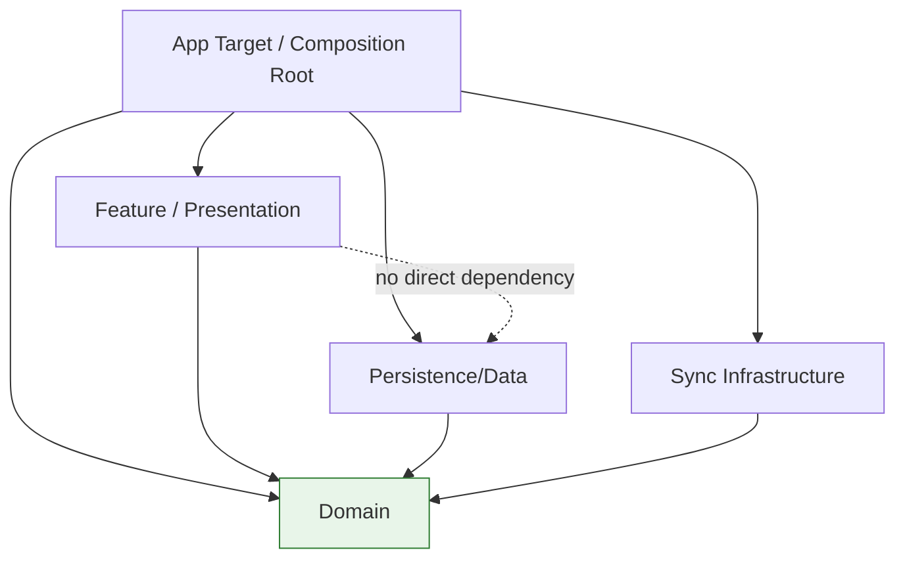

# SwiftUI Architecture (Target)

This document captures the target architecture for BabyTracker using clean boundaries, explicit use cases, and a thin app coordination layer.

## Principles
- Keep presentation logic in feature/UI modules.
- Keep business rules and workflows in domain use cases.
- Keep persistence and sync details in infrastructure modules.
- Depend inward toward stable abstractions.
- Use the app target only as the composition root.

## Layered model

## Responsibilities

### App target
- Builds concrete implementations.
- Wires repositories, use cases, and services.
- Owns application lifecycle integration.

### Feature (Presentation)
- SwiftUI views and presentation models.
- Screen state shaping and event forwarding.
- No persistence or CloudKit details.

### Domain
- Entities and value objects.
- Repository protocols.
- Business policies and use cases.
- Framework-light, test-first business logic.

### Data / Persistence
- SwiftData models and repository implementations.
- DTO/entity mapping and local storage behavior.

### Sync
- CloudKit integration, change tracking, and remote reconciliation.
- Sync orchestration behind protocol seams.

## AppModel target shape
`AppModel` should be an app coordinator, not a business engine. It should:
- own route/navigation/session state
- trigger use cases
- map use case outputs to presentation inputs
- avoid direct repository-heavy read assembly
- avoid embedding sync/persistence business rules

## Refactor intent
- Extract read-side workflows to domain use cases.
- Keep view-specific mapping in feature package.
- Keep package dependencies aligned with boundary rules.
- Split large orchestrators into focused coordinators only when this improves clarity.
